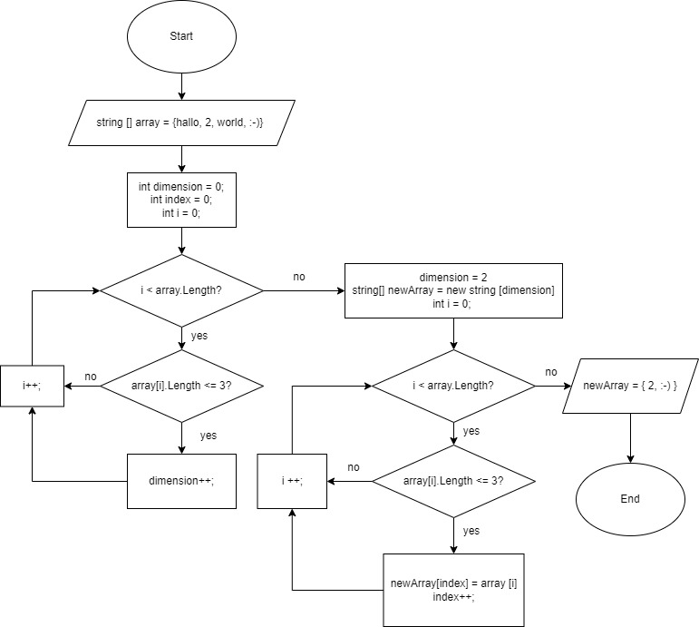

# **Итоговый проект**
**Задача:**

Написать программу, которая из имеющегося массива строк формирует массив из строк, длина которых меньше либо равна 3 символа.

Первоначальный массив можно ввести с клавиатуры, либо задать на старте выполнения алгоритма.

## Алгоритм решения:

1. Получить размерность массива строк с консоли.
2. Получить массив строк с консоли.
3. Вывести первоначальный массив строк на консоль.
4. Создать новый массив из первоначального, где длина строк меньше либо равна 3 символа.
5. Вывести новый массив на консоль.

## Подробное описание метода получения нового массива:

1. Объявить метод, который принимает в качестве аргумента исходный массив строк и возвращает новый массив строк.
2. Объявляем переменные для хранения размера нового массива и индексов с целочисленным типом данных.
3. Объявляем цикл **_for_** , чтобы найти размер нового массива, проверяя каждую строку исходного массива на соответствие условию задачи.
4. Вводим условие **_если длина строки исходного массива меньше или равна 3_**.
5. Если условие выполняется, то увеличиваем размер нового массива на единицу. Итогом выполнения цикла будет найдено количество строк, которое соответствует условию задачи, т.е. длина нового массива.
6. Объявляем новый массив строк с полученной длинной в предыдущем шаге.
7. Объявляем цикл **_for_** , чтобы записать строки из исходного массива в новый, проверяя каждую строку исходного массива на соответствие условию задачи.
8. Вводим условие **_если длина строки исходного массива меньше или равна 3_**.
9. Если условие выполняется, то копируем соответствующую строку из исходного массива в новый, увеливая индекс нового массива. Итогом цикла будет новый массив строк.
10. Возвращаем полученный новый массив строк. Конец метода.

# Блок схема метода получения нового массива

